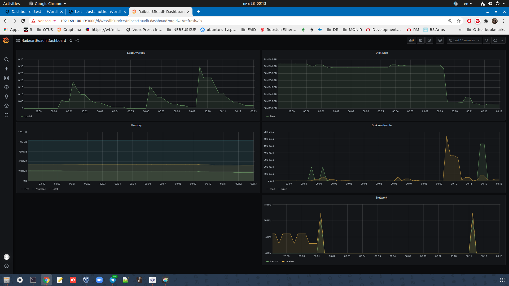
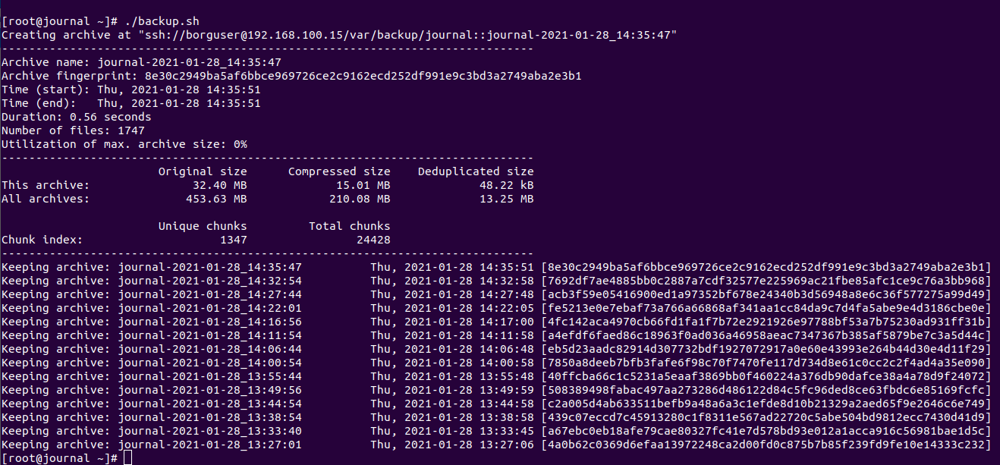

# Для проверки работы вам потребуется установить:
- Ansible 2.9.6
- Oracle VirtualBox 6.0
- Vagrant Vagrant 2.2.19

Если по команде vagrant up из основной директории проекта выдает ошибку образа, требуется скачать и установить образ, аналогичный Centos 7 -  https://app.vagrantup.com/centos/boxes/7
Также трубется заменить название образа, которое вы указали при загрузке (команда vagrant box add --name ИМЯ_ОБРАЗА URL or Address to Image) в файле Vagrantfile проекта.

      Vagrant.configure("2") do |config|
         config.vm.box = "ИМЯ_ОБРАЗА"

------------------------------------------------------------

# Проектная работа - Автоматизация развёртывания платформы WordPress

Цель: Создание рабочего проекта
с развертыванием нескольких виртуальных машин, который
должен отвечать следующим требованиям:
- включен https
- основная инфраструктура в DMZ зоне
- файрволл на входе
- сбор метрик и настроенный алертинг
- везде включен selinux
- организован централизованный сбор логов

# Реализация
## Цели проекта:
- Развернуть стенд, состоящий из нескольких виртуальных машин, который бы отвечал заданным требованиям. В качестве основного web-приложение будет использоваться WordPress — система управления содержимым сайта с открытым исходным кодом. Дополнительно была развернута система резервного копирования данных Borg, основным преимуществом которого является дедупликация и гибкая очистка от старых бэкапов.

Для автоматического развертывания стенда используется ПО Ansible 2.9, ПО для создания и конфигурирования виртуальной среды разработки - Vagrant 2.2.6 и ПО для эмуляции аппаратного обеспечения компьютера - VirtualBox 6.0

Запуск стенда:

		$ vagrant up

Развертывание стенда может занять продолжительное время (от 20 до 30 минут) Завершение работы сценария на иллюстрации ниже:

## Основной адрес (wordpress)

		https://192.168.100.11/wp-login.php

Wordpress развернут на хосте 192.168.100.12 - на 192.168.100.11 он проксирован.

Стартовая странички для кастомизации настроек и управления Wordpress

Страничка сайта по-умолчанию

## Мониторинг и аллертинг
Для реализации задачи были написаны роли для Node Exporter, Grafana и Prometheus.
Адрес системы мониторинга (Grafana)

		https://192.168.100.13:3000/login

Стартовая странички авторизации в Grafana

Для получения доступа к данным мониторинга, выполните:
- введите логин и пароль: admin admin. При входе Grafana предложит сменить стартовый пароль на новый.
- введите новый логин и пароль
- В боковом выберите Dashboards - manages и выберите подготовленный dashboard - `RaibeartRuadh Dashboards`
- Выбранная панель отображает собираемые Prometheus метрики по следующим категориям:

		- Load Average
		- Memory
		- Disk size
		- Disk I/O
		- Network 

Графики на Dashboard

Аллертинг: Используются две категории:
- Предупреждение в телеграм-канал о входе по ssh на любой из хостов ( к примеру для отслеживания работы borg, который использует ssh, входа пользователей)
- Предупреждение в телеграмм-канал о достижении заданного значения заполнения основного диска /dev/sda1 на каждом из хостов (установлены значения 10% для демонстрации. 95% и 99%)

Для отслеживания состояния заполнения основного диска используется система юнит-сервисов - юнит-таймер и юнит-инициатор, вызывающий скрипт.
Для уведомления о входе по ssh используется скрипт `ssh-to-telegram.sh`, который лежит в директории /etc/profile.d, (все скрипты в этой директории отрабатывают при авторизации по ssh).

! Важно ! - ID чата, ID бота и токен бота были специально изменены на несуществующие. Как получить актуальные данные см. 
 https://github.com/RaibeartRuadh/info-to-telegram

		
		
		USERID="-43!!!!!!!!!5"
		KEY="14!!!!!!!!37:AAE!!!!!!!!!!!Y-d4b-_R!!!!!!!!!!!ANk"
		TIMEOUT="10"
		URL="https://api.telegram.org/bot$KEY/sendMessage"
		DATE_EXEC="$(date "+%d %b %Y %H:%M")"
		TMPFILE='/tmp/ipinfo-$DATE_EXEC.txt'
		if [ -n "$SSH_CLIENT" ]; then
			IP=$(awk '{print $1}' <<< $SSH_CLIENT)
			PORT=$(awk '{print $3}' <<< $SSH_CLIENT)
			HOSTNAME=$(hostname -f)
			IPADDR=$(hostname -I | awk '{print $1}')
			curl http://ipinfo.io/$IP -s -o $TMPFILE
			CITY=$(jq -r '.city' < $TMPFILE)
			REGION=$(cat $TMPFILE | jq '.region' | sed 's/"//g')
			COUNTRY=$(cat $TMPFILE | jq '.country' | sed 's/"//g')
			ORG=$(cat $TMPFILE | jq '.org' | sed 's/"//g')
			TEXT="$DATE_EXEC: Вход пользователя ${USER} по ssh на $HOSTNAME
		($IPADDR) из $IP - $ORG - $CITY, $REGION, $COUNTRY через порт $PORT"
			curl -s --max-time $TIMEOUT -d "chat_id=$USERID&disable_web_page_preview=1&text=$TEXT" $URL > /dev/null
			rm $TMPFILE
		fi
Пример:

При входе по SSH не в виртуальной сети должны выводиться данные (пример):

		28 Jan 2021 04:41: 
		Вход пользователя root по ssh 
		на new.site.com (192.168.15.32) из 22.215.110.218 - 
		AS31323 United Networks Ltd. - 
		Saint Petersburg, St.-Petersburg, RU
		через порт 22

## Центральное логирование

На каждом хосте устанавливается systemd-journal-gateway - http-демон, открывающий порт для просмотра (или скачивания) записей журнала 
На хосте journal установлен systemd-journal-remote - демон, скачивающий или принимающий записи журналов на центральном сервере

Проверка логирования:
- Подключиться к хосту journal

 		$ vagrant ssh journal

- Выполнить команду

		$ sudo journalctl -D /var/log/journal/remote --follow

Выполнить какие-либо операции на других хостах, к примеру, рестарт сервисовб авторизуйтесь или выйдите из сессии (также через каждые 5 минут отработывает сервис borg)

## Резервное копирование

Для обеспечения сохранения данных используется пакет Borg, собирающий данные со всех хостов кроме хоста backup:
- Бэкапы сохраняются на хосте backup 192.168.100.15 в директории /var/backup
- Исполнение выполнено через юниты: юнит-таймер и юнит-инициатор, вызывающий скрипт.
- Расписание - каждые 5 минут (для демонстрации). Управление осуществляется службами 
- Скрипт на резервирование:

		#!/bin/bash
		# лок на случай повторного запуска
		LOCKFILE=/tmp/lockfile
		if [ -e ${LOCKFILE} ] && kill -0 `cat ${LOCKFILE}`; then
		    echo "Service already working!"
		    exit
		fi
		trap "rm -f ${LOCKFILE}; exit" INT TERM EXIT
		echo $$ > ${LOCKFILE}
		export BORG_RSH="ssh -i /root/.ssh/id_rsa"
		export BORG_REPO=ssh://borguser@192.168.100.15/var/backup/{{ inventory_hostname }}
		export BORG_PASSPHRASE='password'
		LOG="/var/log/borg_backup.log"
		[ -f "$LOG" ] || touch "$LOG"
		exec &> >(tee -i "$LOG")
		exec 2>&1
		# создание резервных записей
		borg create --verbose --stats --progress \
		  ::{{ inventory_hostname }}-'{now:%Y-%m-%d_%H:%M:%S}' \
		    /root                                \
		    /etc                                 \
		    /var/www                             \
		    /home                                \
		    --exclude /dev                       \
		    --exclude /proc                      \
		    --exclude /sys                       \
		    --exclude /var/run                   \
		    --exclude /run                       \
		    --exclude /lost+found                \
		    --exclude /mnt                       \
		    --exclude /var/lib/lxcfs
		# Очистка от старых резервных записей
		borg prune \
		  -v --list \
		  --keep-within 1m \
		  --keep-monthly 3 
		# удаляем лок
		rm -f ${LOCKFILE}

Пример отработки скрипта

### База данных (Резервирование)

Для работы Wordpress установлен MySQL. Для сохранения дампа базы используется расписание в cron (каждые 5 минут для теста). Дамп сораняется на хосте 192.168.100.13 в директори /var/backup
Пример из playbook ansible для включения расписания в cron на создания дампа.

		- name: Cron job for mysql dump `
		  cron: `
		    name: dumpsql
		    minute: "*/5" 
		    hour: "*" 
		    day: "*" 
		    month: "*" 
		    weekday: "*" 
		    job: 'mysqldump wordpress > "/var/backup/database.sql" --set-gtid-purged=OFF

/var/backup/database.sql - где будут храниться бэкапы
—set-gtid-purged=OFF — указывает то, что мы не используем репликацию на основе глобальных идентификаторов GTID.

## HTTPS

Для возможности работы по https были созданы самподписанные сертификаты.

## Ferewall

Выполнено зональное разделение по сетевым интерфейсам: external (eth0), internal (eth1), dmz (eth2):

    `firewall-cmd --zone=external --change-interface=eth0`  
    `firewall-cmd --zone=internal --change-interface=eth1`  
    `firewall-cmd --zone=dmz --change-interface=eth2`  

Настроен форвардинг

    `echo "net.ipv4.conf.all.forwarding=1" >> /etc/sysctl.d/01-forwarding.conf`  
    `echo "net.ipv4.ip_forward=1" >> /etc/sysctl.d/01-forwarding.conf`  
    `sysctl -p /etc/sysctl.d/01-forwarding.conf`  

Настроен маскарадинг для выхода из локальной сети

    `iptables -t nat -A POSTROUTING ! -d 192.168.0.0/16 -o eth0 -j MASQUERADE`

На внешнем интерфейсе разрешен вход по 443 порту

    `firewall-cmd --zone=external --add-service=https`  

На хост 192.168.100.11 frontend настроим проброс на 80 и 443 порты  
    `firewall-cmd --zone=external --add-forward-port=port=80:proto=tcp:toport=80:toaddr=192.168.255.2`
    `firewall-cmd --zone=external --add-forward-port=port=80:proto=tcp:toport=443:toaddr=192.168.255.2`  

На хостах включен firewall. Проверка состояния и параметров:

		$ firewall-cmd --zone=external --list-all

## Selinux

Включен на каждом хосте. Проверка:
Подключиться к хосту и выполнить команду

` $ sestatus -v `

------------------------------------------------------------------
## Хосты: 

		fwd: ip: '192.168.100.10'       -  Роутер
		front: ip: '192.168.100.11'     -  Frontend (Wordpress)
		web: ip: '192.168.100.12'       -  Wordpress, Grafana, Prometheus, NodeExporter
		db: ip: '192.168.100.13'        -  MySQL
		journal: ip: '192.168.100.14'   -  центральное логирование
		backup:  ip: '192.168.100.15'   -  borg backup

# Что я знал до курса OTUS Linux Professional
У меня были знания уверенного пользователя Unix систем (преимущественно Debian и его семейства). Понимал принципы работы системы, как устанавливать/удалять и управлять приложениями. Где находить логи и журналы. Мог собирать пакеты из исходников с заданными параметрами, был хороший опыт работы с Docker, Nginx, Postgresql. Плохо представлял как работать с сетями - не хватало практики (домашка по сетям для меня были довольно сложной), хотя теоретическая часть у меня не вызывала изумления и в общем-то была понятна. Помню, что стартовал курс с опозданием на неделю и сразу пришлось знакомиться что такое Vagrant и как работать с ядром линукс, как работать с CentOS. И курс был информативным и понятным. Правда тот объем материала, который нужно было познать после 2-х часов лекции, был гораздо больше и не всё усваивалось быстро. Я считаю курс Отус прекрасным профессиональным "пинком", укоряющим развитие специалиста. 
Проектная работа заняла примерно 2 недели. У меня высокая занятость на работе и приходилось буквально сидеть по ночам и в выходные, чтобы успевать. Чего не хватает в курсах - больше живого общения. Может, иногда, стоит делать митинги в zoom просто для знакомства и общения по насущным проблемам. Это быстрее slack и продуктивнее, на мой взгляд. Я пошел на курс, чтобы развиваться и быть более уверенным, чтобы сменить род деятельности (изначально я технический писатель). Также текущая работа выставляла очень высокие требования к пониманию тех или иных процессов и умению быстро на них реагировать.

Документация:
1. https://xakep.ru/2017/02/15/firewalld/
2. https://borgbackup.readthedocs.io/en/stable/
3. https://docs.fedoraproject.org/ru-RU/Fedora/13/html/Security-Enhanced_Linux/sect-Security-Enhanced_Linux-Working_with_SELinux-SELinux_Contexts_Labeling_Files.html
4. https://xakep.ru/2014/09/09/percona-review/
5. https://invs.ru/support/chastie-voprosy/kak-ustanovit-wordpress-na-vps-s-centos-7/
6. https://itdraft.ru/2019/07/26/ustanovka-percona-server-na-centos-7/
7. https://itnan.ru/post.php?c=1&p=317182
8. https://max-ko.ru/34-logi-v-linux-2.html
9. https://grafana.com/grafana/dashboards/11074

